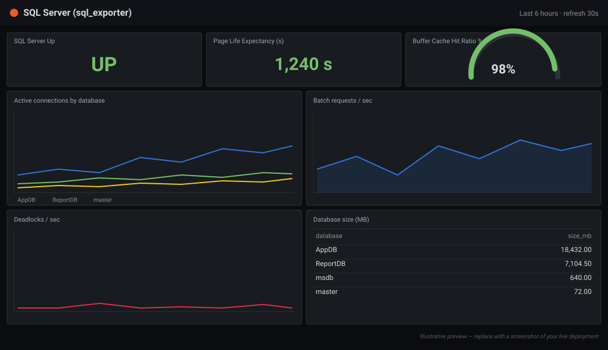

# Monitoring Platform

A self-hosted, on-premises monitoring stack with Site24x7-like capabilities, built
entirely on open-source software (Grafana + Prometheus + Alertmanager + Loki) and
deployed **unmodified**. One VM watches your servers, databases, network gear,
endpoints, Kubernetes, and logs — with alerting to email and chat. No SaaS bills,
no forex.

Designed to be deployed per client as **configuration-as-code**: every target and
credential is a variable, so a new deployment is a scripted install, not a rebuild.

> **Status:** Shared publicly for anyone to **use and adapt** (MIT). **Not accepting
> external contributions at this time** — feel free to fork. See [CONTRIBUTING.md](CONTRIBUTING.md).



> *Illustrative preview of the bundled SQL Server dashboard.* To show a real
> screenshot of your own deployment: open the dashboard in Grafana, take a PNG, save it
> as `docs/images/grafana-mssql.png`, and change the image line above to point at it.

## Repository layout

| Path | What's there |
|---|---|
| [`monitoring-platform/`](monitoring-platform/) | The stack itself — Docker Compose, configs, dashboards, scripts |
| [`monitoring-platform/QUICKSTART.md`](monitoring-platform/QUICKSTART.md) | The fastest path: get it running in a few commands |
| [`monitoring-platform/RUNBOOK.md`](monitoring-platform/RUNBOOK.md) | Beginner-friendly playbook (deploy, add servers, troubleshoot) |
| [`docs/superpowers/specs/`](docs/superpowers/specs/) | The design document |
| [`docs/superpowers/plans/`](docs/superpowers/plans/) | The implementation plan |

## Get started

```bash
cd monitoring-platform
cp .env.example .env    # set a name, a Grafana password, and your targets
bash scripts/deploy.sh
bash scripts/smoke-test.sh
```

Full walkthrough: [monitoring-platform/README.md](monitoring-platform/README.md).

## What it monitors

Linux & Windows hosts, SQL Server, Kubernetes, network gear (SNMP), HTTP endpoints
(uptime), and logs. MongoDB support is included but off by default.

## License

This project's own configuration and scripts are released under the [MIT License](LICENSE).
The upstream tools keep their own licenses — Prometheus and the exporters are
Apache-2.0; Grafana and Loki are AGPLv3 — and are used here unmodified. This project
is not affiliated with or endorsed by Grafana Labs; it is "built on open-source
Grafana and Prometheus."
